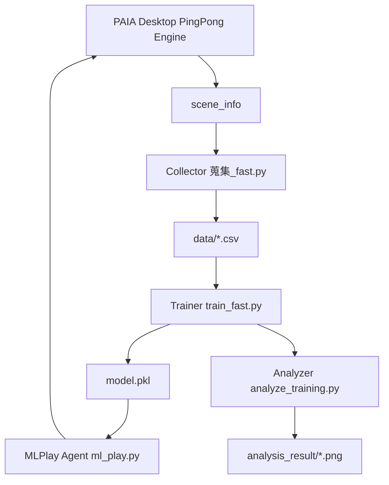
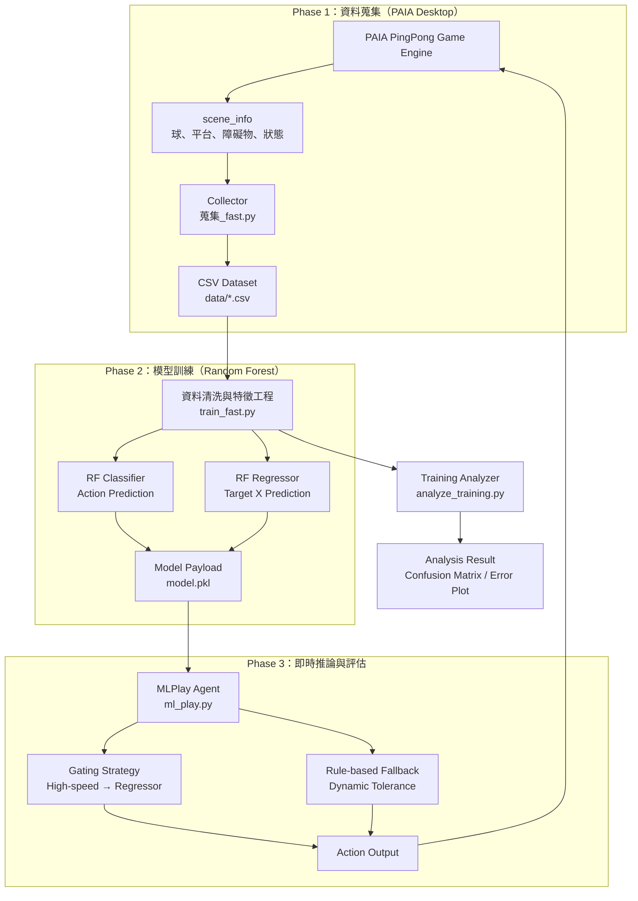

# Ping Pong AI Agent using Random Forest (PAIA Desktop)

## 專案介紹
本專案使用 **PAIA Desktop 乒乓球對戰平台**蒐集遊戲資料，  
以 **Random Forest** 建立機器學習模型，控制平台左右移動進行對戰。

系統採用 **雙模型（Dual-head）設計**：
- **Classifier**：預測離散動作（MOVE_LEFT / MOVE_RIGHT / NONE）
- **Regressor**：預測球落點（target x position）

透過資料清洗、特徵工程與推論階段的容錯策略（rule-based fallback + dynamic tolerance），  
在 **FPS = 30 的即時限制下**，達成穩定對戰效果。

### 驗收指標
- **Normal 對戰模式可獲勝**
- **勝率達到 ≥ 70%**

---

## 專案功能
- **資料蒐集（Collector）**
  - 從 PAIA Desktop 提供的 `scene_info` 擷取遊戲狀態
  - 將狀態與對應動作轉為 CSV 資料集
- **模型訓練（Trainer）**
  - 合併多個 CSV
  - 進行資料清洗與加權
  - 訓練 Random Forest Classifier + Regressor
- **即時推論（MLPlay Agent）**
  - 載入訓練完成的 `model.pkl`
  - 根據速度與距離進行 gating 決策
  - 結合規則式容錯，避免慢球或高速情境失誤
- **訓練可視化分析**
  - 產生速度分佈、混淆矩陣、回歸誤差等圖表

---

## 系統限制與效能目標
- **即時性限制**：FPS = 30，推論延遲需極低
- **穩定性需求**
  - 高速球不可抖動
  - 低速球不可慢半拍
- **驗收條件**
  - Normal 模式勝率 ≥ 70%

---

## 系統分析（模組與資料流）


---

## 專案架構（Phase-based）


---

## API 規格表

### MLPlay Agent API（ml_play.py)

| 項目    | 說明                      |
| ----- | ----------------------- |
| Class | `MLPlay`                |
| 用途    | PAIA Desktop 的 AI Agent |

| Method                         | Input            | Output      | 說明                 |
| ------------------------------ | ---------------- | ----------- | ------------------ |
| `__init__(ai_name)`            | ai_name: str     | None        | 初始化 Agent（1P / 2P） |
| `update(scene_info, keyboard)` | scene_info: dict | action: str | 根據遊戲狀態輸出動作         |
| `reset()`                      | None             | None        | 遊戲結束時重置狀態          |

### action 輸出規格
| Method                         | Input            | Output      | 說明                 |
| ------------------------------ | ---------------- | ----------- | ------------------ |
| `__init__(ai_name)`            | ai_name: str     | None        | 初始化 Agent（1P / 2P） |
| `update(scene_info, keyboard)` | scene_info: dict | action: str | 根據遊戲狀態輸出動作         |
| `reset()`                      | None             | None        | 遊戲結束時重置狀態          |

### 訓練腳本 API（train_fast.py）
| 參數               | 型別    | 說明             |
| ---------------- | ----- | -------------- |
| `--data_dir`     | str   | CSV 資料夾路徑      |
| `--sample_n`     | int   | 抽樣訓練筆數（0 表示全量） |
| `--tth_max_keep` | float | time_to_hit 上限 |
| `--model_path`   | str   | 輸出模型路徑         |

### Model Payload（model.pkl）
```python
payload = {
    "feature_cols": List[str],
    "clf": RandomForestClassifier,
    "reg": RandomForestRegressor,
    "meta": {
        "rows_used": int,
        "seed": int,
        "sample_n": Optional[int],
        "tth_max_keep": float
    }
}

```
| Key            | 說明       |
| -------------- | -------- |
| `feature_cols` | 特徵欄位順序   |
| `clf`          | 動作分類模型   |
| `reg`          | 落點回歸模型   |
| `meta`         | 訓練設定與資料量 |
